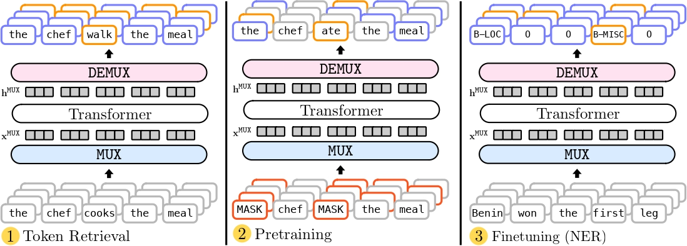

# MUX-PLMs: Language Models with Data Multiplexing ##


## Table of Contents
   * [Setup and Dependencies](#setup-and-dependencies)
   * [Usage](#usage)
      * [Overview](#Overview)
      * [Directory structure](#directory_structure)
      * [Pre-trained checkpoints](#pre-trained-checkpoints)
      * [Fine-tuning](#fine-tuned-checkpoints)
      * [Baselines](#baselines)
   * [Reference](#reference)
   * [License](#license)
### Setup and Dependencies

Our code is implemented in PyTorch. To setup, do the following:

1. Install [Python 3.6](https://www.python.org/downloads/release/python-365/)
2. Get the source:
```
git clone https://github.com/princeton-nlp/datamux-pretraining.git mux_plms
```
3. Install requirements into the `mux_plm` virtual environment, using [Anaconda](https://anaconda.org/anaconda/python):
```
conda env create -f env.yaml
```
4. Make all the `*.sh` files executable with `chmod +x *.sh`

### Usage

#### Overview
For sentence-level classification tasks, refer to `run_glue.py` and `run_glue.sh`. For token-level classification tasks, refer to `run_ner.py` and `run_ner.sh`. Refer to `finetune_driver.sh` for submitting batch jobs for different multiplexing, demultiplexing and model configurations for GLUE and Token tasks.

#### Directory structure

```
/datamux_pretraining/models: Modeling code for MUX-PLMs
    |--/electra_pretraining_trainer.py: Pre-training MUX-ELECTRA trainer 
    |--/mlm_pretraining_trainer.py: Pre-training MUX-BERT trainer
    |--/finetune_trainer.py: Fine-tuning trainer for GLUE and Token tasks
    |--/multiplexing_pretraining_bert.py: Model classes for pre-training and finetuning MUX-BERT models
    |--/multiplexing_pretraining_electra.py: Model classes for MUX-ELECTRA models
    |--/multiplexing_pretraining_legacy.py: Model classes from DataMUX paper from Murahari et al. 
    |--/multiplexing_pretraining_utils.py: Modeling utils for MUX-PLMs
    |--/utils.py: Miscellaneous utils
/datamux_pretraining/configs: Config files for BERT and ELECTRA models
/run_ner.py: Driver python file for Token tasks 
/run_ner.sh: Bash driver script for Token tasks
/run_glue.py: Driver python file for GLUE tasks
/run_glue.sh: Bash driver script for GLUE tasks
/finetune_driver.sh: Bash driver script for batch submitting jobs
/run_pretraining.py: Driver python file to pre-train MUX-BERT and MUX-ELECTRA
```

#### Pre-trained checkpoints

We release pre-trained checkpoints for MUX-BERT models for N= 2,5, and 10 with the `rsa-demux` demultiplexer and the `gaussian_hadamard` multiplexing module introduced by Murahari et al. in DataMUX. 

The pre-trained checkpoints are listed on the Hugging Face [model hub](https://huggingface.co/princeton-nlp). We list our `MUX-BERT` checkpoints below. **For number of instances, select from {2, 5, 10}. For model size, select from {small, base, large}.**

Model ID (BERT): `princeton-nlp/muxbert_<model-type>_gaussian_hadamard_index_pos_<num-instances>`

Pre-trained `BERT` baselines are available at:
Model ID (BERT): `princeton-nlp/bert_<model-type>_1`

Pre-trained `MUX-ELECTRA` models are availabe for the `base` configuration.

Model ID (ELECTRA): `princeton-nlp/muxelectra_base_gaussian_hadamard_index_pos_<num_instances>`

Pre-trained `ELECTRA-base` baseline:

Model ID (ELECTRA): `princeton-nlp/electra_base_1`

We also present pre-trained `MUX-BERT` models for our new contextual multiplexing module for the base configuration:

Model ID: `princeton-nlp/muxbert_base_gaussian_attention_v2_index_pos_<num_instances>`

#### Fine-tuning

We can fine-tune from any of the checkpoints listed above. For instance, this command fine-tunes `MUX-BERT` model on MNLI for N = 2. The model is pretrained with the `gaussian_hadamard` multiplexing module and `rsa_demux` demultiplexing module.

```
sh run_glue.sh \
   -N 2 \
   -d index_pos \
   -m gaussian_hadamard \
   -s finetuning \
   --config_name datamux_pretraining/configs/bert_base.json \
   --lr 5e-5 \
   --task mnli \
   --model_path princeton-nlp/muxbert_base_gaussian_hadamard_index_pos_2 \
   --do_train \
   --do_eval
```

We also release fine-tuned checkpoints for the four largest GLUE Tasks (MNLI, QNLI, QQP, SST2) for `MUX-BERT` models for the `base` configuration.

| Task   | Model name on hub | Full path |
| ----------------|:-------------------|---------:
| MNLI   | muxbert_base_mnli_gaussian_hadamard_index_pos_<num_instances> | princeton-nlp/muxbert_base_mnli_gaussian_hadamard_index_pos_<num_instances>|
| QNLI   | muxbert_base_qnli_gaussian_hadamard_index_pos_<num_instances> |princeton-nlp/muxbert_base_qnli_gaussian_hadamard_index_pos_<num_instances>|
| QQP    | muxbert_base_qqp_gaussian_hadamard_index_pos_<num_instances> | princeton-nlp/muxbert_base_qqp_gaussian_hadamard_index_pos_<num_instances>|
| SST2   | muxbert_base_sst2_gaussian_hadamard_index_pos_<num_instances> | princeton-nlp/muxbert_base_sst2_gaussian_hadamard_index_pos_<num_instances>|

This command finetunes from a fine-tuned MUX-BERT (N=2) model trained on MNLI. The model is pretrained and fine-tuned with the `gaussian_hadamard` multiplexing module and `rsa_demux` demultiplexing module. To simply evaluate these fine-tuned models, get rid of the `do_train` flag.


```
sh run_glue.sh \
   -N 2 \
   -d index_pos \
   -m gaussian_hadamard \
   -s finetuning \
   --config_name datamux_pretraining/configs/bert_base.json \
   --lr 5e-5 \
   --task mnli \
   --model_path princeton-nlp/muxbert_base_mnli_gaussian_hadamard_index_pos_2 \
   --do_train \
   --do_eval
```

Refer to `finetune_driver.sh` to launch multiple experiments at once for different GLUE and Token tasks.

#### Baselines
This command finetunes a pretrained BERT-base model on MNLI.
```
sh run_glue.sh \
-N 1 \
-s baseline \
--config_name datamux_pretraining/configs/bert_base.json \ 
--lr 5e-5 \
--task mnli \
--model_path bert_base_1
--do_train \
--do_eval
```
